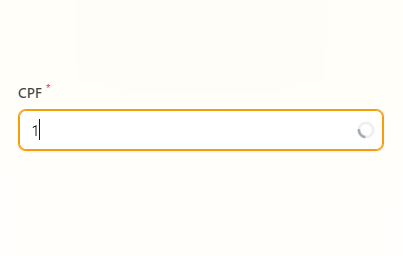

[](https://packagist.org/packages/coringawc/filament-input-loading)
[](https://github.com/coringawc/filament-input-loading/actions/workflows/release.yml)
[](https://packagist.org/packagescoringawc/filament-input-loading)

# Filament Input Loading

Input with option of spinner loading utilizing the 'lazy()' or 'debounce()' methods

## Screenshots



## Installation

You can install the package via composer:

```bash
composer require coringawc/filament-input-loading
```

## Usage

`use CoringaWc\FilamentInputLoading\TextInput;`

`TextInput::make('input')->lazy()->...`

or

`TextInput::make('input')->debounce()->...`

## Changelog

Please see [CHANGELOG](CHANGELOG.md) for more information on what has changed recently.

## Credits

- [CoringaWc](https://github.com/coringawc)

## License

The MIT License (MIT). Please see [License File](LICENSE.md) for more information.
