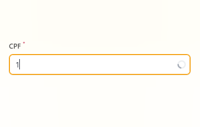

[](https://packagist.org/packages/coringawc/filament-input-loading)
[](https://github.com/coringawc/filament-input-loading/actions/workflows/release.yml)
[](https://packagist.org/packages/coringawc/filament-input-loading)

# Filament Input Loading

A Filament Forms plugin that adds a **loading spinner** to `TextInput` fields when using Livewire's `lazy()` or `debounce()` binding modifiers. The spinner appears inside the input field while the server processes the update, giving users visual feedback.

> **⚠️ Compatibility:** This plugin is built for **Filament v2** (with Livewire v2). It is not compatible with Filament v3/v4/v5.

## Screenshots



## Installation

You can install the package via composer:

```bash
composer require coringawc/filament-input-loading
```

The package auto-discovers its service provider — no manual registration needed.

## Usage

Replace Filament's default `TextInput` import with this package's version:

```php
use CoringaWc\FilamentInputLoading\TextInput;
```

Then use `lazy()` or `debounce()` as you normally would — the loading spinner appears automatically:

```php
// Spinner appears on blur (when the user leaves the field)
TextInput::make('name')->lazy()

// Spinner appears after a debounce delay while typing
TextInput::make('search')->debounce(500)
```

### How It Works

This package extends `Filament\Forms\Components\TextInput` and overrides its Blade view to inject a `wire:loading` spinner indicator. The spinner is positioned inside the input (right side) and only renders when `isLazy()` or `isDebounced()` returns true.

## Credits

- [CoringaWc](https://github.com/coringawc)

## License

The MIT License (MIT). Please see [License File](LICENSE.md) for more information.
